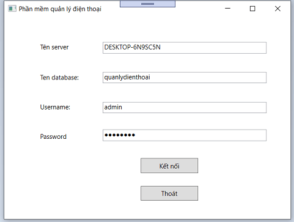
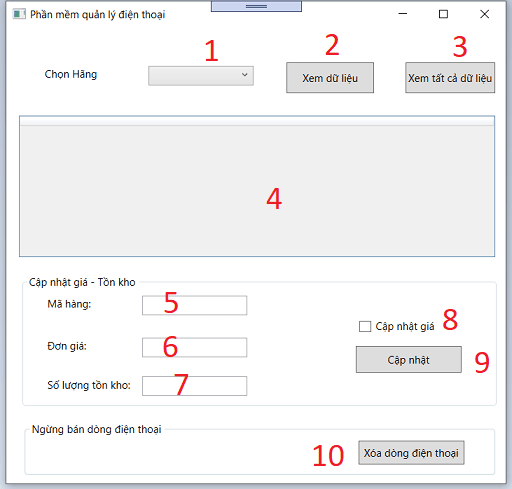
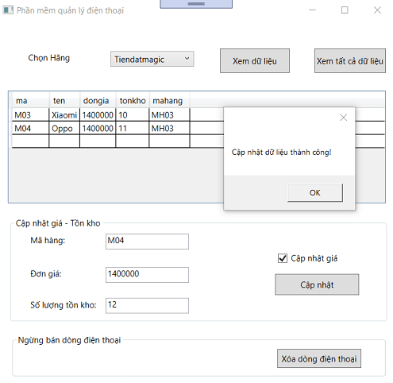

# Hướng dẫn sử dụng phần mềm quản lý điện thoại

## Cách cài đặt và cấu hình

Đầu tiên: Ta cần vào hệ quản trị SQL SERVER, tải tập tin quanlydienthoai.sql có đính kèm sẵn, thực thi dòng đầu tiên là:

create database quanlydienthoai

sau đó tô đen hết dòng còn lại và thực thi câu lệnh sql

Tiếp theo ta cần tạo tài khoản username và password để có thể truy cập vào database

Vào Security -> Chọn Login -> New Login, để tạo tài khoản mới. Trong bài viết này, ta đặt tên Username là admin và password là: 12345678

Bỏ tích Enforce password expiration

Vào phần User Mapping 

Bấm tích vào database quanlydienthoai mà nãy ta vừa tạo 

Ở phần dưới, tại đây ta bấm tích vào 3 mục datareader, datawriter và owner

Sau đó bấm OK, như trong hình:

Rồi bây giờ, ta sẽ mở project quanlydienthoai lên:

Ta vào file app.config

Vì phần username và password ta đã thiết lập chính xác rồi, nên ta chỉ cần thay đổi tên SERVERNAME thành của mình

Ta copy và sửa lại

Tiếp theo, ta vào file Window1.xaml.cs

Ở đây SERVERNAME máy tính của mình là DESKTOP-6N9SC5N , các bạn cần chỉnh sửa thành SERVERNAME của các bạn. Để chỉnh sửa thì ta chỉ việc tô đen vào tên SERVERNAME bấm tố hợp phím Ctrl + H và thay vào tên SERVERNAME của mình

Bấm Replace All

Thế là xong!

Hoàn tất việc cấu hình, giờ ta khởi chạy chương trình thôi!

Ở đây, mình đã thiết lập sẵn các thông số mặc đinh như username và password. Các bạn chỉ cần thay đổi mỗi tên server thành của các bạn là được

Bấm Kết nối, nếu kết nối thành công thì ta đã vào được giao diện chính chương trình, nếu thất bại thì ta xem lại phần kết nối

## Giao diện chương trình và chức năng

Ở đây ta chú ý đến 10 thông số sau:

	1: Dùng để chọn hãng của hãng sản xuất
	2: Xuất dữ liệu sản phẩm từ mã sản xuất
	3: Xuất tất cả các dữ liệu có trong Dienthoai
	4: Bảng hiển thị
	5: Ô nhập mã hàng
	6: Ô nhập đơn giá
	7: Ô nhập số lượng tồn kho
	8: Cập nhật giá, dùng để khóa chức năng cập nhật on/off
	9: Nút bấm cập nhật dữ liệu
	10: Xóa dữ liệu

## Xem dữ liệu

Để xem tất cả các dòng điện thoại, ta chỉ cần bấm chọn **Xem tất cả dữ liệu**

Để chọn dòng điện thoại của từng hãng, ta bấm thanh Combobox xổ xuống, chọn hãng mình muốn, ví dụ chọn hãng Tiendatmagic

Ta bấm Xem

## Cập nhật dữ liệu

Để cập nhật dữ liệu ta cần nhập mã hàng sản phẩm vào ô mình cần cập nhật, sau đó nhập Đơn giá, Số lượng tồn kho, bấm tích chọn Cập nhật giá và bấm Cập nhật

Nếu ta chưa bấm tích cập nhật giá vào checkbox, thì khi bấm Cập nhật sẽ báo lỗi **Dữ liệu bị khóa**

Khi cập nhật dữ liệu ta cần chú ý để tránh các lỗi sau:

	Dữ liệu nhập vào không được bỏ trống
	Dữ liệu Đơn giá hoặc số lượng tồn kho không thể là số âm
	Dữ liệu Đơn giá nhập vào phải là số chia hết cho 1000 (đề bài yêu cầu)

Khi bấm Cập nhật, nếu không vấn đề gì thì chương trình sẽ hỏi xem ta có muốn cập nhật dữ liệu không

Ta chọn Yes, lập tức sẽ hiển thị thêm bảng Thông báo hỏi dữ liệu ta nhập vào là tăng hay giảm giá, nhằm để xác thực chắc chắn dữ liệu người nhập luôn chính xác

Chọn Yes, thế là xong!

Dữ liệu sau khi cập nhật thành công:

Nếu dữ liệu nhập vào lại là số âm, thì sẽ lập tức báo lỗi:

Và còn một số lỗi khác.

## Xóa dữ liệu

Để xóa dữ liệu ta cần nhập mã hàng sản phẩm cần xóa, rồi bấm Xóa là xong

Lưu ý: Nếu người dùng quên nhập thông tin Mã hàng cần xóa sẽ lập tức báo lỗi:

Và khi xóa dữ liệu ta cần chú ý để tránh các lỗi sau:

	Dữ liệu cần xóa phải là dữ liệu có số lượng tồn kho bằng 0, tức nếu còn hàng thì không được xóa

Nếu tồn hàng bằng 0, ta có thể xóa và không gặp vấn đề gì

Sẽ có một dòng cảnh báo, chắc chắn xóa, ta chọn Yes

Dữ liệu xóa thành công!

Hướng dẫn sử dụng: <a href="https://www.youtube.com/watch?v=Gv4IIOeMAn4">Link youtube</a>
